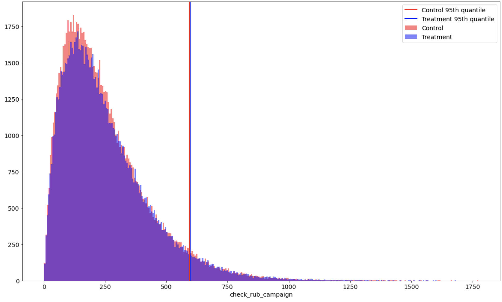
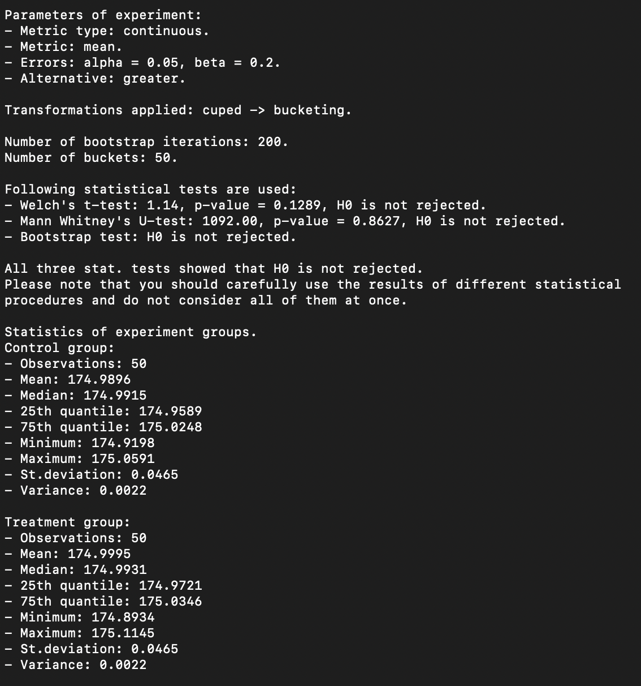
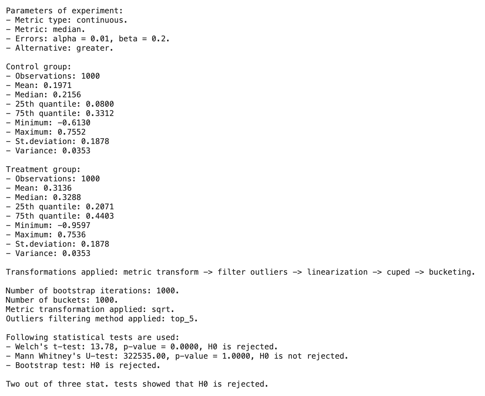

Experiment Evaluation
=====================

After the initialization of experiment, we are ready to dive into the analysis.

You have the following options for analysis:

- Statistical Inference
- Metric Transformations
- Increasing Sensitivity (Variance Reduction)
- Visualizations
- Reporting

|

"""""""""""""""""""""
Statistical Inference
"""""""""""""""""""""

**ABacus** supports three types of metrics: continuous, binary, and ratio.
Each of these types requires its own particular methods to conduct statistical analysis of experiment.

**ABacus** has the following statistical tests for each type of metric:

1. For continuous metrics: ``Welch t-test``, ``Mann-Whitney U-test``, ``bootstrap``.
2. For binary metrics: ``chi-squared test``, ``Z-test``.
3. For ratio metrics: ``delta method``, ``Taylor method``.

To get the result of a test, just call the appropriate statistical method on your ABTest instance:

.. code-block:: python

    ab_test = ABTest(...)

    ab_test.test_welch()
    {'stat': 5.172, 'p-value': 0.312, 'result': 0}

    # or

    ab_test.test_mannwhitney()
    {'stat': 0.12, 'p-value': 0.67, 'result': 0}

As a result, you'll get dictionary with

- statistic of the test,
- p-value of this empirical statistic,
- result in binary form: 0 - H0 is not rejected, 1 - H0 is not accepted.

|

""""""""""""""""""""""
Metric Transformations
""""""""""""""""""""""

Sometimes experiment data cannot be analyzed directly due to different limitations such as presense of outliers or form of distribution.
Metric transformation techniques available in ABacus are:

- **Outliers removal**: direct exclusion of outliers according to some algorithm. There are two methods implemented in **ABacus**: remove ``top 5%`` observations and ``isolation forest``.

.. code-block:: python

    hypothesis_params = HypothesisParams(..., filter_method='isolation_forest')

    ab_test = ABTest(...)
    ab_test_2 = ab_test.filter_outliers()

    print(ab_test.params.data_params.control)
    # 200 000

    print(ab_test_2.params.data_params.control)
    # 198 201

- **Functional transformation**: application of any function to your target metric in order to make it more normal or remove outliers. The following example includes functional transformation with ``sqrt`` function:

.. code-block:: python

    hypothesis_params = HypothesisParams(..., metric_transform=np.sqrt)

    ab_test = ABTest(...)
    ab_test_2 = ab_test.metric_transform()

- **Bucketing**: aggregation of target metric into buckets in order to obtain smaller number of points for analysis and from initial distribution to distributions of means.

.. code-block:: python

    hypothesis_params = HypothesisParams(..., n_buckets=1500)

    ab_test = ABTest(...)
    ab_test_2 = ab_test.bucketing()

- **Linearization**: remove dependence of observations (and move from ratio target) using linearization approach.

.. code-block:: python

    data_params = DataParams(..., is_grouped=False)

    ab_test = ABTest(...)
    ab_test_2 = ab_test.linearization()

|

"""""""""""""""""""""""""""""""""""""""""""
Increasing Sensitivity (Variance Reduction)
"""""""""""""""""""""""""""""""""""""""""""

As you want to make your metrics more sensitive, you will mostly likely want to use some sensitivity increasing techniques.
**ABacus** supports the following options for increasing sensitivity of your experiments:

* **CUPED (Controlled experiment Using Pre-Experiment Data)** uses information about covariate independent from experiment.

.. code-block:: python

    data_params = DataParams(..., covariate='pre_experiment_metric')

    ab_test = ABTest(...)
    ab_test_2 = ab_test.cuped()

* **CUPAC (Control Using Predictions as Covariate)** predicts variable that can be used as a covariate.

.. code-block:: python

    data_params = DataParams(..., predictors_prev=['pre_pred_1', 'pre_pred_2'],
                                  predictors_now=['now_pred_1', 'now_pred_2'],
                                  target_prev='pre_experiment_metric')

    ab_test = ABTest(...)
    ab_test_2 = ab_test.cupac()

* **Stratification** allows you to remove variance using not sample random sampling, but stratified sampling.

.. code-block:: python

    data_params = DataParams(..., strata_col='city')
    hypothesis_params = HypothesisParams(..., strata='city',
                                              strata_weights={
                                                'Moscow': 0.6,
                                                'Voronezh': 0.1,
                                                'Samara': 0.3
                        })

    ab_test = ABTest(...)
    ab_test_2 = ab_test.test_strat_confint()

|

""""""""""""""
Visualizations
""""""""""""""

A picture is worth a thousand words. No doubt that you want to visually explore your experiment.

You can plot experiments with continuous and binary variables.
Continuous plots illustrates not only distributions of desired targe variable, but also a desired metric of a distribution.
You can also plot a bootstrap distribution of differences if you want to estimate your experiment with bootstrap approach.

Here is the output of ``ab_test.plot()`` method:

|

"""""""""
Reporting
"""""""""

As you may wish to get some sort of report with information of your experiment, you can definitely do it with ABacus.

You just need to call ``ab_test.report()`` and get information about preprocessing steps and results of statistical tests:

Report is available for any metric type. On each metric type, you will get a bit different results.

|

""""""""""""""""""
Everything at once
""""""""""""""""""

You can freely mix everything you saw above using **chaining**.

.. code-block:: python

    ab_test = ABTest(...).filter_outliers().metric_transform().cuped().bucketing()
    ab_test.test_welch()

As you can see, you just need to call methods one by one.
``ab_test.report()`` will show information about all applied transformations:

