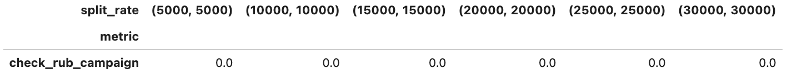

MDE Researcher
==============

**MDE Researcher** makes experimental design in order to get all the information about your experiment.
The main purpose of its usage is calculation of samples size needed to detect particular effect size based on type
I and II errors, directionality of hypothesis and other parameters.

There are three components in experimental design:

- `data and hypothesis parameters <./experiment_initialization.html>`_;
- `splitter parameters <./splitter.html>`_;
- actual experimental design parameters (this section).

This is an example of everything at once for experimental design:

.. code-block:: python

    from abacus.splitter.split_builder import SplitBuilder
    from abacus.splitter.params import SplitBuilderParams
    from abacus.mde_researcher.params import MdeParams
    from abacus.mde_researcher.mde_research_builder import MdeResearchBuilder
    from abacus.mde_researcher.multiple_split_builder import MultipleSplitBuilder

    # data, data params and hypothesis
    df = pd.read_csv('./data/ab_data.csv')
    data_params = DataParams(
        id_col='user_id',
        group_col='groups',
        control_name='control',
        treatment_name='treatment',
        is_grouped=True,
        target='check_rub_campaign'
    )
    hypothesis_params = HypothesisParams(
        alpha=0.01,
        beta=0.2,
        alternative='greater',
        metric_type='continuous',
        metric_name='mean',
    )
    ab_params = ABTestParams(data_params, hypothesis_params)

    # splitter params
    split_builder_params = SplitBuilderParams(
        map_group_names_to_sizes={
            'control': None,
            'target': None
        },
        main_strata_col = "city",
        split_metric_col = "check_rub_campaign",
        id_col = "user_id",
        cols = ["check_rub_pre_campaign"],
        cat_cols=["gender"],
        pvalue=0.05,
        n_bins = 6,
        min_cluster_size = 500
    )

    # design params
    experiment_params = MdeParams(
        metrics_names=['check_rub_campaign'],
        injects=[1.010, 1.013, 1.015, 1.018, 1.02, 1.030],
        min_group_size=5_000,
        max_group_size=30_000,
        step=5_000,
        variance_reduction=None,
        use_buckets=False,
        stat_test=ABTest.test_welch,
        iterations_number=10,
        max_beta_score=0.9,
        min_beta_score=0.2,
    )

    # simulation of experimental design
    design = MdeResearchBuilder(df,
                                  ab_params,
                                  experiment_params,
                                  split_builder_params)
    beta, alpha = design.collect()

As a result, you  will see something similar to the following tables:

- for type II error (:math:`\beta`)

Table should be read as follow: if you think that effect size of the experiment will be 1.8%
and you want to constraint type II error by 20%, then the minimum number of observations in each
group must be at least 25 000.

- for type I error (:math:`\alpha`)

