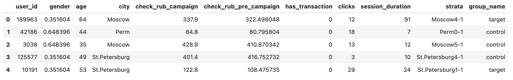

Splitter
========

**Splitter** is a core instrument that allows you to get 'equal' groups for your experiment. Groups of an experiment are
equal in the sense of users' desired characteristic of experiment are equal.

It is a crucial part of any experiment design - to get approximately equal groups.
Splitter in **ABacus** not only allows you to split your observations into groups, but also assesses the quality of this split.

.. code-block:: python

    df = pd.read_csv('./data/ab_data.csv')

    split_builder_params = SplitBuilderParams(
        map_group_names_to_sizes={
            'control': 20_000,
            'target': 30_000
        },
        main_strata_col = "city",
        split_metric_col = "check_rub_campaign",
        id_col = "user_id",
        cols = ["check_rub_pre_campaign"],
        cat_cols=["gender"],
        pvalue=0.05,
        n_bins = 6,
        min_cluster_size = 500
    )

    split_builder = SplitBuilder(df, split_builder_params)
    split = split_builder.collect()

    split.head()

After the application of splitter to your data, you will see two additional columns to your data — **strata** and **group_name**:

- ``strata``: strata of observation created by clustering algorithm (HDBSCAN).
- ``group_name``: groups of experiment. Control group have the same group name - ``control``, and the treatment is called ``target``.
